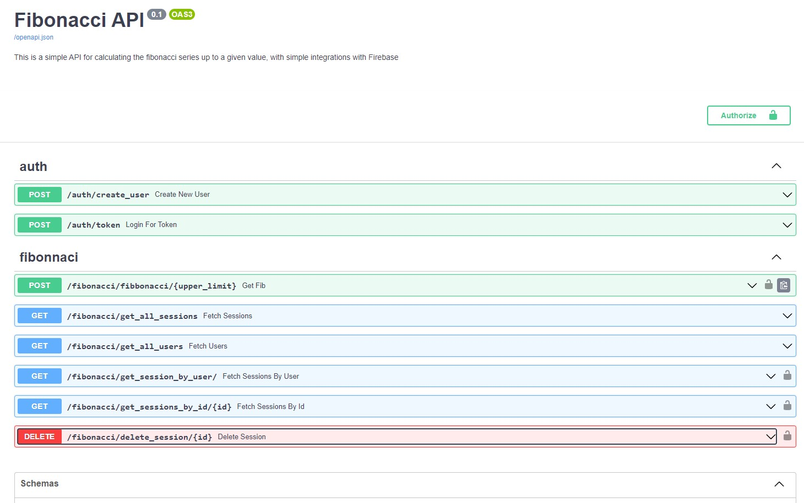
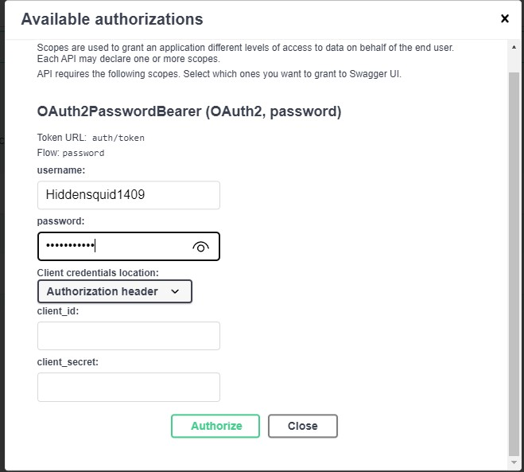
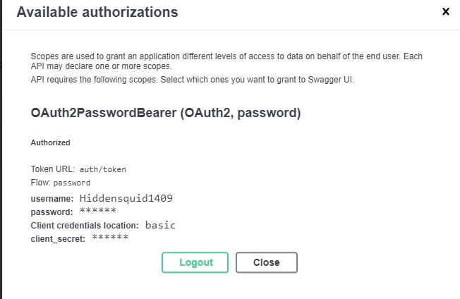

# Fast API Microservice for Fibonacci Series

This is a simple microservice built using Fast API. This microservice has a main endpoint which is located at `/fibonacci` and it takes a single parameter `upper_limit` which is an integer. The endpoint returns a list of fibonacci numbers up to the upper limit.

Also, this microservice has a user based authentication system. The user can register and login to the system to authenticate the requests to the main endpoint. 

## How to run the microservice

firstly you will need to clone this repository and isntall all the necesary libraries with the following commands:

``` bash
> git clone https://github.com/jorgegarcia197/fast_api_fibonnaci.git
> cd fast_api_fibonnaci
> python -m venv .venv && source .venv/bin/activate
> pip install -r requirements.txt
 ```

and to spin up the microservice you will need to go into the `src` folder and run the following command:

``` bash
python -m uvicorn main:app --reload 
```
and open the link that is shown in the terminal in your browser adding the `/docs` path to the end of the link. if done correctly you should see the following page popping up:



## Authentication

After that, you will need to create a user to be able to authenticate the requests. To do that just try out the first endpoint which is the `/auth/create_user` endpoint and fill the form. Use that user to sign in with the Authorize button in the top right corner of the page. After that you will be able to use the main endpoint to get the fibonacci series up to the upper limit you want.

 

## Usage
Now that you have a user and you are logged in you can use the main endpoint to get the fibonacci series up to the upper limit you want. Just fill the form and click execute. You will get a response with the fibonacci series up to the upper limit you specified.

Additionally, you do certain aditional operations with your submissions:
    - You can get all your submissions by clicking the `Get all submissions` endpoint.
    - You can get all the users subscribed to the service by clicking the `Get all users` endpoint.
    - You can get a all the submissions of a specific user by clicking the `Get all sessions by user` endpoint.
    - You can get a specific submission by id by clicking the `Get session by id` enpoint.
    - You can delete a specific submission by id by clicking the `Delete session by id` endpoint. This will only delete the submission if the session belongs to the user that is logged in.

## Firebase
This service is connected to a firebase database, the database is used to store all the submissions and all the users in different collections.


## Local sessions
This repo also saves the sessions within the  `src/output` directory. The sessions are saved with the json response from the service and are stored in separate folders for each user. The folder name is the user id and the file name is the session id. The session id is the same as the submission id.


### Contact
If you have any questions or suggestions you can contact me at jorge.garciaserna97@gmail.com
